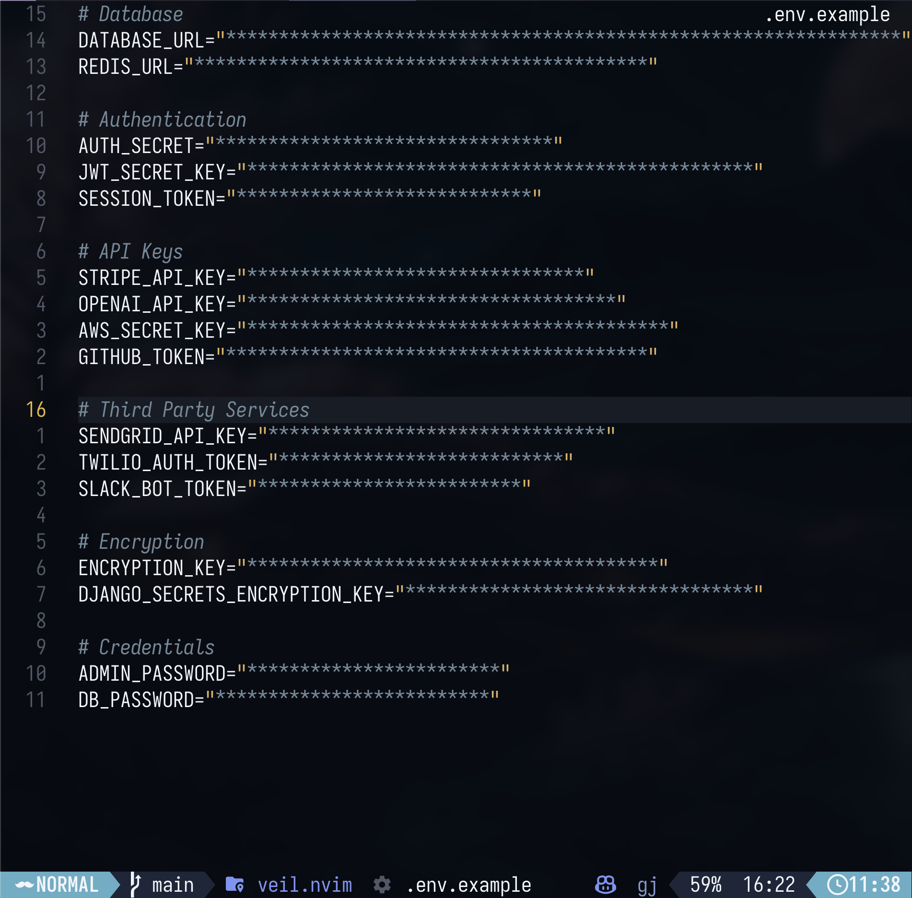

# veil.nvim

A Neovim plugin to hide sensitive values in `.env` files and other configuration files.

Unlike other plugins that rely on complex patterns, **veil.nvim** uses simple, predictable patterns that work with standard configuration file formats.

## Veil Working!



## Veil Example Video

https://github.com/user-attachments/assets/9583b667-2e98-41b7-990f-298eed37e402


## Features

- Automatically conceals sensitive values in `.env`, `.npmrc`, `.pypirc`, and more
- Works with standard `KEY=value` and `key: value` formats
- Configurable patterns for custom keywords
- Toggle on/off with simple commands
- Auto-enables on matching files

## Installation

### lazy.nvim

```lua
{
  "Gentleman-Programming/veil.nvim",
  config = function()
    require("veil").setup()
  end,
}
```

### packer.nvim

```lua
use {
  "Gentleman-Programming/veil.nvim",
  config = function()
    require("veil").setup()
  end,
}
```

## Usage

### Commands

- `:Veil` - Toggle veil on/off
- `:VeilEnable` - Enable veil
- `:VeilDisable` - Disable veil
- `:VeilPeek` - Reveal value on current line only (toggle)

### Default Keybindings

- `<leader>sv` - Toggle veil on/off
- `<leader>sp` - Peek at value on current line

You can customize or disable them:

```lua
require("veil").setup({
  keymaps = {
    toggle = "<leader>vv",  -- Custom keymap
    peek = false,           -- Disable this keymap
  },
})
```

## Configuration

### Basic setup (uses defaults)

```lua
require("veil").setup()
```

### Adding your own files and patterns

```lua
require("veil").setup({
  -- Add extra files (merged with defaults)
  extra_files = {
    "config.secret.json",
    "*.credentials",
  },

  -- Add extra patterns - can be simple keywords or full patterns
  extra_patterns = {
    -- Simple keywords (automatically converted to patterns)
    "MY_CUSTOM_VAR",
    "COMPANY_API_KEY",
    
    -- Or full Lua patterns for more control
    { pattern = "(CUSTOM_PREFIX_%w+%s*[=:]%s*)[\"']?([^\"'\n]+)", group = 2 },
  },
})
```

### Full configuration options

```lua
require("veil").setup({
  -- Files where veil is automatically enabled (defaults)
  files = {
    ".env",
    ".env.*",
    ".npmrc",
    ".pypirc",
    "credentials.json",
    "secrets.yaml",
    "secrets.yml",
    ".secrets",
  },

  -- Patterns to match - the VALUE part will be concealed (defaults)
  patterns = {
    { pattern = "(%w+_KEY%s*[=:]%s*)[\"']?([^\"'\n]+)", group = 2 },
    { pattern = "(%w+_SECRET%s*[=:]%s*)[\"']?([^\"'\n]+)", group = 2 },
    { pattern = "(%w+_TOKEN%s*[=:]%s*)[\"']?([^\"'\n]+)", group = 2 },
    { pattern = "(%w+_PASSWORD%s*[=:]%s*)[\"']?([^\"'\n]+)", group = 2 },
  },

  -- Character used to conceal (default: *)
  conceal_char = "*",

  -- Auto enable on matching files (default: true)
  auto_enable = true,

  -- Extra files added by user (merged with defaults)
  extra_files = {},

  -- Extra patterns added by user (merged with defaults)
  extra_patterns = {},

  -- Use ONLY your files, ignore defaults (default: false)
  exclude_default_files = false,

  -- Use ONLY your patterns, ignore defaults (default: false)
  exclude_default_patterns = false,

  -- Customize the color of concealed text (default: uses theme's Comment color)
  highlight = nil, -- or { fg = "#ff0000" } for custom color

  -- Reveal values when entering insert mode on the line (default: false)
  reveal_on_insert = false,

  -- Default keybindings (set to false to disable individual keymaps)
  keymaps = {
    toggle = "<leader>sv",  -- Toggle veil
    peek = "<leader>sp",    -- Peek at values
  },
})
```

## How it works

Veil uses Neovim's built-in `conceal` feature with `matchadd()` to hide sensitive values. When you open a matching file (like `.env`), it automatically:

1. Detects lines matching the configured patterns
2. Conceals only the VALUE part, leaving the key visible
3. Shows `*` characters instead of the actual values

Example:
```
# What's in the file:
API_KEY="super_secret_key_123"

# What you see with Veil enabled:
API_KEY=**********************
```

## License

MIT

## Contributing

Issues and PRs welcome at [Gentleman-Programming/veil.nvim](https://github.com/Gentleman-Programming/veil.nvim)
